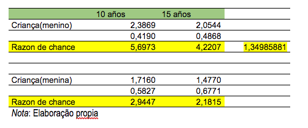

```{r}
library(here)
library(caret)
library(dplyr)
library(glmnet)
library(readxl)
library(magrittr)
```

#### Ex1

Para estudar a associação entre gênero (1=Masc, 0=Fem) e idade (anos) e a preferência (1=sim, 0=não) pelo refrigerante Kcola, o seguinte modelo de regressão logística foi ajustado aos dados de 50 crianças escolhidas ao acaso:

$\log(\frac{\pi_{i}*(x_{i}, w_{i})}{1-\pi_{i}*(x_{i}, w_{i})}) = \alpha + \beta x_{i} + \gamma(w_{i} - 5)$

Em que $x_{i}(w_{i})$ representa o gênero (idade) da i-ésima criança e $\pi_{i}(x_{i}, w_{i})$ a probabilidade de uma criança do gênero $x_{i}y$ idade $w_{i}$ preferir Kcola. As siguientes estimativas para os parâmetros foram obtidas:

```{r}
table = read.csv(file = here('ep3/ex1', 'table.csv'), header=TRUE, sep=';')
table
```

a-) Interprete os parâmetros do modelo por intermédio de chances e razões de chances

Resposta:

Assim como o modelo de regressão linear procura determinar a relação funcional entre a variável dependente e a variável independente, lembre-se de que, em um modelo de regressão linear, a função de link é a função de identidade e, no modelo de regressão logística, o A função de link é a transformação do logit e possui o seguinte formato no seguinte problema

$\log(\frac{\pi_{i}*(x_{i}, w_{i})}{1-\pi_{i}*(x_{i}, w_{i})}) = \alpha + \beta x_{i} + \gamma(w_{i} - 5)$

Observa-se que todas as variáveis são significativas e que existem duas variáveis preditoras, o gênero (binário) e a idade (numérica). 
Devemos ter em mente que, quando os coeficientes forem positivos, a chance será maior que 1 e, se for negativa, será menor que 1. 
Antes de apresentar a interpretação em termos de odds e odds ratio, será apresentada a interpretação formal dos coeficientes. por exemplo, na interpretação de gênero. Quando o sexo varia, ou seja, de 0 a 1, as probabilidades logarítmicas da preferência de kcola mudam em 0,33. Essa interpretação, embora exata, significa pouco para a maioria dos analistas. Está correto em um modelo de regressão logística. Portanto, podemos dizer que o valor do parâmetro beta é a quantidade da taxa de alteração na preferência do Kcola com base na alteração de uma unidade no gênero. Como o gênero é binário, é a quantidade de mudança na preferência de Kcola quando o gênero passa de 0 a 1 em valor. (Joseph M. Hilbe Pág. 15).
A chance de preferir o Kola, dado que é um homem, é exp (0,33) ou 1,39 mais provável de preferir o Kola que é uma mulher. Outra maneira de expressar isso é a chance de preferir Kola, pois ela é uma menina é 1 / exp (0,33) ou 0,72 vezes maior do que as chances de ser um menino.
A razão de chances para o menino ser homem = = 1 é a razão de chances de preferir a kola como um menino à chance de preferir a kola como uma menina. = 1.9347. esto Isso indica que uma condição ou evento com maior probabilidade de ocorrência não é um grupo de crianças do sexo masculino.
A razão de chances do menino ser mulher = = 0 é a razão de chances de preferir a kola como uma menina à chance de preferir a kola como um menino. = 0,51685. Esse valor indica que, quanto menor a probabilidade de não ser o primeiro grupo que o segundo, as mulheres foram consideradas como o primeiro grupo.
As expressões podem variar quando se considera quem é o primeiro ou o segundo grupo, no entanto, as interpretações não variam.
No caso da idade, estamos com uma variável contínua e é interpretada da seguinte forma, El chances de preferir la Kola dado que es un niño de wi años es exp(-0,03) o 0,97 mas probable de preferir la kola conforme van transcurriendo los años.
As chances de preferir o Kcola, dado que ele é uma criança de wi  anos, é exp (-0,03) ou 0,97 mais probabilidade de preferir o Kcola com o passar dos anos. Devemos lembrar que o estudo analisa apenas crianças.
Como o preditor contínuo, é mais complexo, no entanto, possui a mesma lógica, a razão de chance da criança odds (11) / odds (10) e uma razão de chances, que é o mesmo valor para todos os pares de valores não preditores. Seja a razão de chances para idade de 1,01 e uma resposta para interrupção, podemos afirmar que a chance de preferência da Kola é 1% maior para cada 1 ano de idade de uma criança. (Joseph M. Hilbe Pág. 32).

---

b-) Com as informações acima, estime a razão de chances de preferência por Kcola correspondente à comparação de crianças do mesmo gênero com 10 e 15 anos.



c-) Construa intervalos de confiança (com coeficiente de confiança aproximado de 95%) para  e  e traduza o resultado em linguagem não técnica.

Resposta:
Antes de construir os intervalos de confiança, devemos recordar que um coeficiente de `0` não tem nenhum efeito na compreensõa da variável resposta de interesse. (Joseph M. Hilbe Pág. 24)

Os intervalos de confiança de 95% com base no modelo logístico são calculados da seguinte forma:

li<- coef - qnorm(.975) * se

ls <- coef +qnorm(.975) * se

```{r}
qnorm(0.975)
```

```{r}
y=exp(0.33); y
```


```{r}
w=exp(-0.03); w
```

$\exp(\beta)$

```{r}
LI=y-qnorm(0.975)*0.10; LI
```
```{r}
LS=y+qnorm(0.975)*0.10; LS
```
$\exp(\gamma)$
```{r}
LI=w-qnorm(0.975)*0.005; LI
```
```{r}
LS=w+qnorm(0.975)*0.005; LS
```

d-) Estime a probabilidade de meninos com 15 anos preferirem Kcola.
```{r}
exp15=0.69+0.33*1-0.03*(15-5); exp15
```
A probabilidade é de 0,72 de que uma criança de gênero homens dado que tem 15 anos prefira kcola. 

---

#### Ex 2
Obtenha os estimadores Ridge, Lasso e ElasticNet para os dados do exemplo 6.7 (arquivo esteira)
Y = VO2; X = IMC e Carga; n = 28;

```{r}
esteira <- read_xls(here('data', 'esteira.xls'), range = cell_cols("B:D"))
esteira
```

Resposta:

Num primero momento, vamos aplicar a Validação Cruzada com diferentes metodos para estimar a melhor penalização (λ). A título de comparação seram feitos três diferentes algoritmos, como apresentado nas salas de aula
Usando o Pacote glmnet com k=4 para obter os estimadores de Ridge, Lasso e ElasticNet.


```{r}
names(esteira)
```


```{r}
set.seed(123)
exemplos_treino <- esteira$VO2 %>% createDataPartition(p=0.8, list=FALSE)
train <- esteira[c(exemplos_treino), ]
test <- esteira[-exemplos_treino, ]

X <- model.matrix(VO2~., train) [,-1]
X_test <- model.matrix(VO2~., test) [,-1]
y <- train$VO2
```

##### Ridge
```{r}
cv_ridge <- cv.glmnet(X, y, alpha = 0)
cv_ridge$lambda.min
```


```{r}
model_ridge <- glmnet(X, y, alpha = 0, lambda = cv_ridge$lambda.min)
coef(model_ridge)
```


```{r}
ridge <- model.matrix(VO2 ~., test)[,-1]
predict_ridge <- model_ridge %>% predict(X_test) %>% as.vector()
data.frame(RMSE = RMSE(predict_ridge, test$VO2), Rsquare = R2(predict_ridge, test$VO2))
```

##### Lasso

```{r}
set.seed(123)
cv_lasso = cv.glmnet(X, y, alpha = 1)
cv_lasso$lambda.min
```


```{r}
model_lasso <- glmnet(X, y, alpha = 1, lambda = cv_lasso$lambda.min)
coef(model_lasso)
```


```{r}
predict_lasso <- model_lasso %>% predict(X_test) %>% as.vector()
data.frame(RMSE = RMSE(predict_lasso, test$VO2),Rsquare = R2(predict_lasso, test$VO2))
```

##### Elastic Net 
```{r}
set.seed(123)
model_elastic <- train(VO2~., data=train, method="glmnet", trControl = trainControl("cv", number = 10), tuneLenght = 10)
model_elastic$bestTune
```


```{r}
coef(model_elastic$finalModel, model_elastic$bestTune$lambda)
```


```{r}
X_elastic = model.matrix(VO2~., test)[,-1]
predict_elastic <- model_elastic %>% predict(X_elastic)
data.frame(RMSE = RMSE(predict_elastic, test$VO2), Rsquare = R2(predict_elastic, test$VO2))
```

```{r}
table = read.csv(file = here('ep3/ex2', 'table.csv'), header=TRUE)
table
```


Os três valores lambda são diferentes considerando a regularização e usando validação cruzada para validar a capacidade de generalização do modelo de regressão, Nesse procedimento, os dados não foram padronizados. Nesta parte, tentamos comparar os resultados usando diferentes algoritmos e observa-se que o R2 é maior pelo método de Ridge e Lasso, porém o RMSE é menor pelo método do Lasso em os algoritmos.
Os três valores de R2 são muitos próximos, mas o menor RMSE é mais baixo por tanto o modelo LASSO presenta maior precisão, que os outro dois modelos.  
Essa medida de ajuste indica quão próximos os pontos dos valores observados estão dos valores previstos do modelo, portanto, procura-se o menor possível para fornecer uma estimativa melhor na previsão do modelo. Nesse caso, o método Lasso fornece melhores previsões para o modelo de regressão.
Essa medida de ajuste indica quão próximos os pontos dos valores observados estão dos valores previstos do modelo, portanto, procura-se o menor possível para fornecer uma estimativa melhor na previsão do modelo. Nesse caso, o método Lasso fornece melhores previsões para o modelo de regressão.


Num segundo momento, vamos aplicar a Validação Cruzada com diferentes tamanhos para estimar a melhor penalização (λ). A título de comparação foram feitos três diferentes testes: k=4, escolhido de forma a diminuir a perda de informação na divisão do dataset (com 28 observações); k=10, o mais bem aceito tamanho de k da literatura e k=n, que força uma validação cruzada leave-one-out (LOOCV), bastante recomendada para conjuntos pequenos. Os dados também foram centralizados, o que é uma boa prática para os modelos de regressão aqui utilizados. 

##### Teste com diferentes Ks para K-Fold Cross-Validation (sem hold-out) 

```{r}
esteira <- read_xls(here('data', 'esteira.xls'), range = cell_cols("B:D"))
esteira
```

```{r}
names(esteira)
```

```{r}
# centralizando o conjunto
y <- esteira %>% select(VO2) %>% scale(center = TRUE, scale = FALSE) %>% as.matrix()
X <- esteira %>% select(-VO2) %>% as.matrix()

# Realiza o k-fold Cross-Validation pra escolher o Lambda
# Vetor lambdas_to_try de -3 a 5, com tamanho 100
lambdas_to_try <- 10^seq(-3, 5, length.out = 100)

ridge_cv_4 <- cv.glmnet(X, y, alpha = 0, lambda = lambdas_to_try, standardize = TRUE, nfolds = 4)

ridge_cv_10 <- cv.glmnet(X, y, alpha = 0, lambda = lambdas_to_try, standardize = TRUE, nfolds = 10)

# Para LeaveOneOut CV
n = length(y)  #n = 28
ridge_cv_n <- cv.glmnet(X, y, alpha = 0, lambda = lambdas_to_try, standardize = TRUE, nfolds = n)
```
#### Plots dos resultados de CV para RIDGE


```{r}
plot(ridge_cv_4)
```
```{r}
plot(ridge_cv_10)
```


```{r}
plot(ridge_cv_n)
```


Este gráfico permite ver a sequência dos valores lambda e o valor mínimo está entre as linhas verticais de cada gráfico, que são 0.3199267, 0.001 e 0,1519911. Esse ponto no eixo x do gráfico é onde o menor erro de precisão é obtido.


```{r}
print(list(ridge_cv_4$lambda.min, ridge_cv_10$lambda.min, ridge_cv_n$lambda.min))
```


#### Fazendo o Fit do Modelo com glmnet
```{r}
ridge_4 <- glmnet(X, y, alpha=0, lambda = ridge_cv_4$lambda.min, standardize = TRUE)
ridge_10 <- glmnet(X, y, alpha=0, lambda = ridge_cv_10$lambda.min, standardize = TRUE)
ridge_n <- glmnet(X, y, alpha=0, lambda = ridge_cv_n$lambda.min, standardize = TRUE)
 
print(list(coef(ridge_4), coef(ridge_10), coef(ridge_n)))
```


#### Predição de Ridge para modelos com diferentes lambdas
```{r}
y_predict_4 <- predict(ridge_4, X)
y_predict_10 <- predict(ridge_10, X)
y_predict_n <- predict(ridge_n, X)

```
##### Cálculo da soma dos quadrados dos resíduos 
```{r}

ssr_cv_4 <- t(y - y_predict_4) %*% (y - y_predict_4)
ssr_cv_10 <- t(y - y_predict_10) %*% (y - y_predict_10)
ssr_cv_n <- t(y - y_predict_n) %*% (y - y_predict_n)
print(list(ssr_cv_4, ssr_cv_10, ssr_cv_n))
```

#### Cálculo do R2
```{r}
rsq_ridge_4 <- cor(y, y_predict_4)^2
rsq_ridge_10 <- cor(y, y_predict_10)^2
rsq_ridge_n <- cor(y, y_predict_n)^2
print(list(rsq_ridge_4, rsq_ridge_10, rsq_ridge_n))
```

##### Conclusão Ridge

- R²: Os 3 testes são similares em ajuste, com R² aproximado de 0,759
- Resíduos: Menor resíduo médio é com k=10
- Variância: Menor variância estimada é k=4

---

### Lasso

```{r}
######################## LASSO ###########################
lasso_cv_4 <- cv.glmnet(X, y, alpha=1, lambda = lambdas_to_try, standardize = TRUE, nfolds = 4)
lasso_cv_10 <- cv.glmnet(X, y, alpha=1, lambda = lambdas_to_try, standardize = TRUE, nfolds = 10)
lasso_cv_n <- cv.glmnet(X, y, alpha=1, lambda = lambdas_to_try, standardize = TRUE, nfolds = n)
```


```{r}
plot(lasso_cv_4)
```


```{r}
plot(lasso_cv_10)
```


```{r}
plot(lasso_cv_n)
```

Este gráfico permite ver a sequência dos valores lambda e o valor mínimo está entre as linhas verticais de cada gráfico, que são 0.1519911, 0.07220809 e 0.0869749. Esse ponto no eixo x do gráfico é onde o menor erro de precisão é obtido.


```{r}
# Lambdas
print(list(lasso_cv_4$lambda.min, lasso_cv_10$lambda.min, lasso_cv_n$lambda.min))
```


```{r}
# Modelos
lasso_4 <- glmnet(X, y, alpha = 1, lambda = lasso_cv_4$lambda.min, standardize = TRUE)
lasso_10 <- glmnet(X, y, alpha = 1, lambda = lasso_cv_10$lambda.min, standardize = TRUE)
lasso_n <- glmnet(X, y, alpha = 1, lambda = lasso_cv_n$lambda.min, standardize = TRUE)
 
print(list(coef(lasso_4), coef(lasso_10), coef(lasso_n)))
```


```{r}
# Predições
y_lasso_4 <- predict(lasso_4, X)
y_lasso_10 <- predict(lasso_10, X)
y_lasso_n <- predict(lasso_n, X)
```


```{r}
# Resíduos
ssr_lasso_4 <- t(y - y_lasso_4) %*% (y - y_lasso_4)
ssr_lasso_10 <- t(y - y_lasso_10) %*% (y - y_lasso_10)
ssr_lasso_n <- t(y - y_lasso_n) %*% (y - y_lasso_n)
 
print(list(ssr_lasso_4, ssr_lasso_10, ssr_lasso_n))
```


```{r}
# Ajuste R²
rsq_lasso_4 <- cor(y, y_lasso_4)^2
rsq_lasso_10 <- cor(y, y_lasso_10)^2
rsq_lasso_n <- cor(y, y_lasso_n)^2
print(list(rsq_lasso_4, rsq_lasso_10, rsq_lasso_n))
```

#### Conclusão Lasso
- R²: Os 3 testes são similares em ajuste, com R² aproximado de 0,759
- Resíduos: Menor resíduo médio é com k=4
- Variância: Menor variância estimada é k=4

---

Usando o Pacote Caret com k=4 para obter os estimadores de Ridge, Lasso e ElasticNet.

```{r}
#Separando o DataSet
names(esteira)
```


```{r}
# separando em dados de teste e treino para CV
set.seed(123)
exemplos_treino <- esteira$VO2 %>% createDataPartition(p=0.8, list=FALSE)

train <- esteira[c(exemplos_treino), ]
test <- esteira[-exemplos_treino, ]

train_center <- train %>% scale(center = TRUE, scale = FALSE)
test_center <- test %>% scale(center = TRUE, scale = FALSE)
```


```{r}
#Variaveis de predição
X <- model.matrix(VO2~., train) [,-1] # n = 24
y <- train$VO2

X_center <- model.matrix(VO2~., as.data.frame(train_center)) [,-1]
y_center <- as.data.frame(train_center)$VO2
```


```{r}
#usando o pacote caret
#Definindo o Range possível de Lambda
lambda <- 10^seq(-3, 3, length = 100)
```


```{r}
#ridge
set.seed(123)
ridge <- train(VO2~., data = train, method = "glmnet", trControl = trainControl("cv", number = 4), tuneGrid = expand.grid(alpha = 0, lambda = lambda))
ridge$bestTune$lambda
 
coef(ridge$finalModel, ridge$bestTune$lambda)
 
predictions_ridge <- ridge %>% predict(test)
data.frame(RMSE = RMSE(predictions_ridge, test$VO2),Rsquare = R2(predictions_ridge, test$VO2))
```


```{r}
#Lasso
set.seed(123)
lasso <- train(VO2~., data = train, method = "glmnet", trControl = trainControl("cv", number = 4), tuneGrid = expand.grid(alpha = 1, lambda = lambda))
lasso$bestTune$lambda

coef(lasso$finalModel, lasso$bestTune$lambda)

predictions_lasso = lasso %>% predict(test)

data.frame(RMSE = RMSE(predictions_lasso, test$VO2),Rsquare = R2(predictions_lasso, test$VO2))
```


```{r}
# Elastic (deveria ser o mesmo do anterior)
set.seed(123)
elastic <- train(VO2~., data = train, method = "glmnet", trControl = trainControl("cv", number = 4), tuneLength = 10)
elastic$bestTune$lambda

coef(elastic$finalModel, elastic$bestTune$lambda)
 
predictions_elastic = elastic %>% predict(test)
data.frame(RMSE = RMSE(predictions_elastic, test$VO2), Rsquare = R2(predictions_elastic, test$VO2)) 

models <- list(ridge = ridge, lasso = lasso, elastic = elastic)
resamples(models) %>% summary( metric = "RMSE")
```

Ao comparar o desempenho do melhor algoritmo usando o Pacote Caret com k = 4 no modelo de regressão, a estimativa de regressão de Ridge tem um desempenho melhor usando este pacote.


Nesta parte, observa-se que os valores lambda não estão tão distantes dos mostrados no pacote gmlnet; no entanto, os resultados dos coeficientes do modelo de regressão são muito próximos. No entanto, podemos observar que há uma diferença mínima entre R2 e RMSE, mas, ao escolher, o melhor modelo preditivo é sempre procurado e o algoritmo Elastic Net fornece um RMSE menor, o que indica que ele fornece uma melhor previsão do modelo.
Além disso, podemos mencionar que nos três casos em que trabalhamos com uma estimativa centralizada, o RMSE é menor e os coeficientes associados aos regressores nos modelos de rede de Ridge e Elastic são mantidos e no modelo de Lasso há uma variação.


---

#### Ex3

Obtenha os estimadores Ridge, Lasso e ElasticNet para os dados do Exemplo 6.11, com a variável Resposta sendo FC (Frequência Cardíaca).

```{r}
esforco = read_xlsx(here('ep3/ex3', 'esforco.xlsx'))
esforco
```

Inicialmente, o trabalho será realizado sem considerar o relacionamento entre as variáveis, aplicaremos apenas os métodos de regularização 

```{r}
# Holdout
set.seed(123)
train_samples <- esforco$FC %>% createDataPartition(p=0.8, list=FALSE)

treino <- esforco[c(train_samples), ]
teste <- esforco[-train_samples, ]
X <- model.matrix(FC~., treino)[,-1]
y <- treino$FC
treino_center <- treino %>% scale(center = TRUE, scale = FALSE)
teste_center <- teste %>% scale(center = TRUE, scale = FALSE)
X_center <- X %>% scale(center = TRUE, scale = FALSE)
y_center <- y %>% scale(center = TRUE, scale = FALSE)
```


```{r}
#### RIDGE
ridge_cv_4 <- cv.glmnet(X, y, alpha = 0, nfolds = 4)
ridge_cv_4$lambda.min
```


```{r}
ridge_cv_10 <- cv.glmnet(X, y, alpha = 0, nfolds = 10)
ridge_cv_10$lambda.min
```


```{r}
ridge_4 <- glmnet(X, y, alpha = 0, lambda = ridge_cv_4$lambda.min, nfolds = 4)
coef(ridge_4)
```


```{r}
ridge_10 <- glmnet(X, y, alpha = 0, lambda = ridge_cv_10$lambda.min, nfolds = 10)
coef(ridge_10)
```


```{r}
X_teste <- model.matrix(FC~., teste)[,-1]
ridge_pred_4 <- ridge_4 %>% predict(X_teste)
ridge_pred_10 <- ridge_10 %>% predict(X_teste)
```


```{r}
data.frame(RMSE = RMSE(ridge_pred_4, teste$FC), Rsquare = R2(ridge_pred_4, teste$FC))
```


```{r}
data.frame(RMSE = RMSE(ridge_pred_10, teste$FC), Rsquare = R2(ridge_pred_10, teste$FC))
```


```{r}
############## CENTRALIZADO #################
ridge_cv_10_c <- cv.glmnet(X_center, y_center, alpha = 0, nfolds = 10)
ridge_cv_10_c$lambda.min
```


```{r}
ridge_10_c <- glmnet(X_center, y_center, alpha = 0, lambda = ridge_cv_10_c$lambda.min)
coef(ridge_10_c)
```


```{r}
X_teste_c <-model.matrix(FC~., as.data.frame(teste_center))[,-1]
ridge_pred_10_c <- ridge_10_c %>% predict (X_teste_c)
data.frame(RMSE = RMSE(ridge_pred_10_c, teste_center[,1]), Rsquare = R2(ridge_pred_10_c, teste_center[,1]))
```


```{r}
## LASSO
set.seed(123)
lasso_cv <- cv.glmnet(X, y, aplha = 1, lambda = NULL, nfolds = 10)
lasso_cv$lambda.min
```


```{r}
lasso <- glmnet(X, y, alpha = 1, lambda = lasso_cv$lambda.min, nfolds = 10)
coef(lasso)
```


```{r}
lasso_pred <- lasso %>% predict(X_teste) %>% as.vector()
data.frame(RMSE = RMSE(lasso_pred, teste$FC), Rsquare = R2(lasso_pred, teste$FC))
```


```{r}
### LASSO CENTER
lasso_cv_c <- cv.glmnet(X_center, y_center, alpha = 1, lambda = NULL, nfolds = 10)
lasso_cv_c$lambda.min
```


```{r}
lasso_c <- glmnet(X_center, y_center, alpha = 1, lambda = lasso_cv_c$lambda.min, nfolds = 10)
coef(lasso_c)
```


```{r}
lasso_pred_c <- lasso_c %>% predict(X_teste_c)
data.frame(RMSE = RMSE(lasso_pred_c, teste_center[,1]), Rsquare = R2(lasso_pred_c, teste_center[,1]))
```


```{r}
##TESTE CARET PACKAGE
set.seed(123)
lambda <- 10^seq(-3, 3, length=100)
 
ridge1 <- train(FC~., data = treino, method = "glmnet", trControl = trainControl("cv", number = 10), tuneGrid = expand.grid(alpha = 0, lambda = lambda))
coef(ridge1)
```


```{r}
coef(ridge1$finalModel, ridge1$bestTune$lambda)
```


```{r}
ridge1_pred <- ridge1 %>% predict(teste)
data.frame(RMSE = RMSE(ridge1_pred, teste$FC), Rsquare = R2(ridge1_pred, teste$FC))
```


```{r}
# Lasso
lasso1 <- train(FC~., data = treino, method = "glmnet", trControl = trainControl("cv", number = 10), tuneGrid = expand.grid(alpha = 1, lambda = lambda))
coef(lasso1$finalModel, lasso1$bestTune$lambda)
```


```{r}
lasso1_pred <- lasso1 %>% predict(X_teste)
data.frame(RMSE = RMSE(lasso1_pred, teste$FC), Rsquare = R2(lasso1_pred, teste$FC))
```


```{r}
## ELASTIC
set.seed(123)
elastic <- train(FC~., data=treino, method = "glmnet", trControl = trainControl ("cv", number = 10), tuneLenght = 10)
elastic$bestTune
```


```{r}
coef(elastic$finalModel, elastic$bestTune$lambda)
```


```{r}
pred <- elastic %>% predict(X_teste)
data.frame(RMSE = RMSE(pred, teste$FC), Rsquare = R2(pred, teste$FC))
```


```{r}
# Comparação entre os modelos
models <- list(ridge = ridge1, lasso = lasso1, elastic = elastic)
resamples(models) %>% summary( metric = "RMSE")

```

### 2² estimative, sem a variável PESO, que foi suprimida por todos os modelos

```{r}
ridge2 <- train(FC~., data = treino, method = "glmnet", trControl = trainControl("cv", number = 10), tuneGrid = expand.grid(alpha = 0, lambda = lambda))
coef(ridge2$finalModel, ridge2$bestTune$lambda)
```


```{r}
ridge2_pred <- ridge2 %>% predict(X_teste)
data.frame(RMSE = RMSE(ridge2_pred, teste$FC), Rsquare = R2(ridge2_pred, teste$FC))
```


```{r}
#Lasso
lasso2 <- train(FC~., data = treino, method = "glmnet", trControl = trainControl("cv", number = 10), tuneGrid = expand.grid(alpha = 1, lambda = lambda))

coef(lasso2$finalModel, lasso2$bestTune$lambda)
```


```{r}
lasso2_pred <- lasso2 %>% predict(X_teste)
data.frame(RMSE = RMSE(lasso2_pred, teste$FC), Rsquare = R2(lasso2_pred, teste$FC))
```


```{r}
#Elastic
elastic2 <- train(FC~., data=treino, method = "glmnet", trControl = trainControl ("cv", number = 10), tuneLenght = 10)
elastic2$bestTune
```


```{r}
coef(elastic2$finalModel, elastic2$bestTune$lambda)
```


```{r}
elastic2_pred <- elastic2 %>% predict(X_teste)
data.frame(RMSE = RMSE(elastic2_pred, teste$FC), Rsquare = R2(elastic2_pred, teste$FC))
```


```{r}
# Comparação entre os modelos
models <- list(ridge = ridge2, lasso = lasso2, elastic = elastic2)
resamples(models) %>% summary( metric = "RMSE")
```

Nos resultados apresentados em cada um deles, o R2 é quase nulo, o que indica que não há relação linear entre a variável resposta e os preditores, tendo sido realizado como exercício, conforme indicado no problema. Agora vamos ver qual é a solução para o problema. 


```{r}
pairs(esforco, main="Gráfico de Dispersão") 
```

A figura acima apresenta o gráfico de dispersão que demonstra alta correlação entre as variáveis superfície e preso. Em conclusão, a variável resposta deve ser altamente correlacionada com as variáveis preditoras. Por outro lado... a tabela abaixo mostra uma correlação muito pequena entre FC e as demais explicativas.

```{r}
cor(esforco)
```
Portanto, observa-se que os modelos apresentam R² muito pequeno (aprox., 0,013), mostrando que a explicação da variação total do FC não é bem representada pelas explicativas. 


Para determinar as variáveis relevantes, será aplicado o método stepwise para a seleção de variáveis

```{r}
# método stepwise
RLM.vacio=lm(formula=FC~1,esforco)
RLM.Completo=lm(formula = FC~.,esforco)
RLM.stepwise=step(RLM.vacio,scope=list(lower=RLM.vacio,upper=RLM.Completo),direction = "both")
```


```{r}
summary(RLM.stepwise)
```


Conclusão:
Para termas, um modelo de regressão, independentemente do método, é necessário fazer uma correlação entre os vários explicativos e os outros. Nos resultados obtidos, apenas uma variável preditora deve ser incluída e nenhum método de regularização é necessário, pois para aplicar esse método é necessário que as variáveis variáveis existam multicolinearidade.


---

##### Ex 4

(a) Use a função *rnorm()* (simula valores de uma distribuição normal) do R para gerar um preditor X com n = 100 observações, bem como um erro ε também de comprimento 100.

```{r}
x <- rnorm(100); x
```


```{r}
e <- rnorm(100); e
```
(b) Simule um vetor de resposta Y , de comprimento n = 100 de acordo com o modelo
$Y =\beta  + \beta_{1} x + \beta_{2}x$, na qual os parˆametros βi s˜ao constantes de suaescolha.

```{r}
Bi = 5
y <- Bi + Bi*x + Bi*x^2 + Bi*x^3 + e
head(y)

```

(c) Considere o modelo de (b), agora com os βi e ε desconhecidos, X como em (a) Y como em (b). Qual seria o melhor modelo usando R2 ajustado e BIC?
```{r}
### polinomial de grau 3
 
modelo4 <- lm(y~poly(x, 3))
summary(modelo4)

```

```{r}
BIC(modelo4)
```

```{r}
# polinomial de grau 2

modelo4_2 <- lm(y~poly(x, 2))
summary(modelo4_2)
```


```{r}
BIC(modelo4_2)
```

(d) Para o modelo como em (c), obtenha os estimadores ridge e lasso. Use VC para selecionar o valor  ótimo de $\lambda$

```{r}
library(readxl)
exercicio4 <- read_excel(here('ep3/ex4', 'exercicio4.xlsx'))
exercicio4
```
```{r}
set.seed(123)
train_samples <- exercicio4$y %>% createDataPartition(p=0.8, list = FALSE)
treino <- exercicio4[c(train_samples), ]
teste <- exercicio4[-train_samples, ]
X <- model.matrix(y~., treino)[,-1]
y <- treino$y
############ RIDGE ##########
ridge_cv <- cv.glmnet(X, y, alpha=0)
ridge_cv$lambda.min
```


```{r}
ridge <- glmnet(X, y, alpha = 0, lambda = ridge_cv$lambda.min)
coef(ridge)
```


```{r}
X_teste <- model.matrix(y~., teste)[,-1]
ridge_pred <- ridge %>% predict(X_teste)
data.frame(RMSE = RMSE(ridge_pred, teste$y), Rsquared = R2(ridge_pred, teste$y))
```


```{r}
#### Lasso
lasso_cv <- cv.glmnet(X, y, alpha=1)
lasso_cv$lambda.min
```


```{r}
lasso <- glmnet(X, y, alpha = 1, lambda = lasso_cv$lambda.min)
coef(lasso)
```


```{r}
lasso_pred <- lasso %>% predict(X_teste)
data.frame(RMSE = RMSE(lasso_pred, teste$y), Rsquared = R2(lasso_pred, teste$y))
```

##### Conclusão:
Ao aplicar a regressão Ridge, os coeficientes de x e x3 são praticamente nulos e o R2 é quase zero, isso mostra que é importante conhecer diferentes técnicas de previsão. No caso da regularização Lasso, acontece o mesmo. Deve-se lembrar que os métodos de regularização são aplicados quando há um problema de multicolinearidade. 


